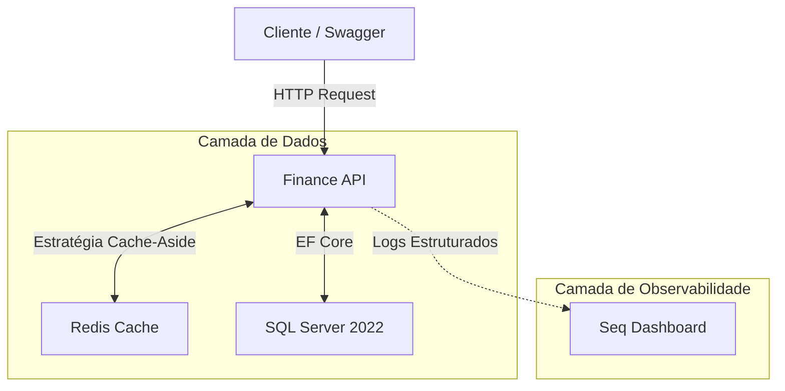

# 💰 Finance API — Gestão Financeira Enterprise


A **Finance API** é uma solução de back-end **robusta, segura e de alta performance** para controle e gestão de transações financeiras. Desenvolvida em **.NET 8**, aplica rigorosamente os princípios da **Clean Architecture**, garantindo baixo acoplamento, alta testabilidade e escalabilidade.

O projeto vai além do CRUD tradicional, focando em **Performance** (Cache Distribuído), **Segurança** (JWT & Data Protection) e **Observabilidade** (Logs Estruturados), simulando um ambiente real de produção pronto para crescer.

---

## 🏗️ Arquitetura & Design

A aplicação foi desenhada para suportar **alta concorrência de leitura**, mantendo **consistência de dados** e **simplicidade operacional**, utilizando uma arquitetura containerizada e orquestrada.



---

## 🌟 Diferenciais Técnicos Implementados

### ⚡ Cache Distribuído (Redis)

* Implementação estratégica do padrão **Cache-Aside (Lazy Loading)**

* **Leitura Otimizada (`GetById`):**
  Respostas em sub-milissegundos para entidades acessadas com frequência.

* **Consistência em Escritas (Invalidação Cirúrgica):**
  As chaves de cache são invalidadas em operações de **Update** e **Delete**, garantindo que nenhum dado obsoleto seja retornado.

* **Listagens (`GetAll`):**
  Decisão arquitetural consciente de manter listagens paginadas **direto no banco**, evitando complexidade desnecessária de cache.

### 🔍 Observabilidade

* Centralização de **logs estruturados** com **Serilog + Seq**
* Permite rastreio de falhas, auditoria de operações e análise de performance em tempo real

### 🔐 Segurança

* Autenticação via **JWT (JSON Web Tokens)**
* Persistência segura de chaves criptográficas utilizando **ASP.NET Data Protection API**
* Chaves armazenadas em volumes Docker compartilhados, garantindo resiliência entre containers

### 🐳 Containerização

* Ambiente **plug-and-play** via **Docker Compose**
* Toda a infraestrutura sobe com um único comando:

  * API
  * SQL Server
  * Redis
  * Seq

---

## 🛠️ Tech Stack

| Categoria           | Tecnologias                                                      |
| ------------------- | ---------------------------------------------------------------- |
| **Core**            | .NET 8, C# 12                                                    |
| **Arquitetura**     | Clean Architecture, Repository Pattern, Handlers estilo Mediator |
| **Banco de Dados**  | SQL Server 2022, Entity Framework Core 8                         |
| **Performance**     | Redis, StackExchange.Redis, IDistributedCache                    |
| **Observabilidade** | Serilog, Seq                                                     |
| **Documentação**    | Swagger / OpenAPI (com suporte a Auth)                           |
| **Qualidade**       | xUnit, Moq, FluentAssertions, FluentValidation                   |
| **DevOps**          | Docker, Docker Compose                                           |

---

## 🚀 Como Rodar o Projeto

A forma **mais simples e profissional** de executar o projeto é utilizando **Docker**. Não é necessário instalar o .NET SDK nem compilar manualmente.

### ✅ Pré-requisitos

- [Docker Desktop](https://www.docker.com/products/docker-desktop/) instalado

### ▶️ Passo a Passo

```bash
git clone https://github.com/alysonsz/Finance-API.git
cd Finance-API
```

```bash
docker-compose up -d
```

⏳ Aguarde **30 a 60 segundos** para o SQL Server inicializar e aplicar as migrações automaticamente.

---

## 🔗 Acesso aos Serviços

| Serviço           | URL                                                            | Credenciais (Dev)                               |
| ----------------- | -------------------------------------------------------------- | ----------------------------------------------- |
| **API (Swagger)** | [http://localhost:5000/swagger](http://localhost:5000/swagger) | —                                               |
| **Seq Logs**      | [http://localhost:5341](http://localhost:5341)                 | User: `admin` <br> Pass: `MyStrongPassword123!` |
| **SQL Server**    | `localhost:1433`                                               | User: `sa` <br> Pass: `MyStrongPassword123!`    |

---

## 🧪 Testando a Performance (Redis)

Para validar a eficiência da arquitetura:

1. Acesse o **Swagger** → [http://localhost:5000/swagger](http://localhost:5000/swagger)
2. Crie uma transação (`POST v1/transactions`)
3. Busque a transação com `GET v1/transactions/{id}`

* **Primeira chamada:** SQL Server → grava no Redis (**Cache Miss**) ~50ms+
* **Segunda chamada:** retorno direto do Redis (**Cache Hit**) < 5ms

4. Execute um **UPDATE** ou **DELETE** na mesma transação

✅ A chave é invalidada automaticamente e a próxima leitura reflete os dados atualizados.

---

## 📂 Estrutura do Projeto

A solução segue rigorosamente os princípios da **Clean Architecture**, com responsabilidades bem definidas e uma camada dedicada para **contratos compartilhados**, evitando acoplamentos indevidos entre API, Application e clientes.

```
Finance API
├── 📁 Finance.Domain          # Entidades, Enums, Interfaces e Regras de Negócio
├── 📁 Finance.Application     # Casos de Uso (Handlers), Validações, Mapeamentos
├── 📁 Finance.Contracts       # DTOs, Requests, Responses e Interfaces Compartilhadas
├── 📁 Finance.Infrastructure  # EF Core, Redis, Repositórios, Migrations
├── 📁 Finance.Api             # Controllers, Docker, DI, Middlewares
└── 📁 Finance.Tests           # Testes (organizados por camada: Domain, Application, Api)
```

> 💡 **Observação:** a camada de testes é organizada por contexto/camada para refletir a arquitetura da solução, facilitando manutenção, leitura e evolução dos testes.
---

## 🔐 Autenticação

A API utiliza **JWT** para proteger os endpoints.

1. Registre um usuário: `POST v1/auth/register`
2. Faça login: `POST v1/auth/login`
3. Copie o `accessToken` retornado
4. No Swagger, clique em **Authorize** e informe:

```
Bearer SEU_TOKEN
```

---

### 👨‍💻 Autor

Desenvolvido por **Alyson Souza Carregosa**
Focado em **Engenharia de Software de Alta Performance** e **Arquitetura de Soluções**.

---

## 📄 Licença

Este projeto está licenciado sob a **MIT License**.
